# RAG-GOV: Policy-Aware Graph-Enhanced RAG System

[](https://www.python.org/)
[](LICENSE)
[](https://fastapi.tiangolo.com/)

A policy-aware hybrid Retrieval-Augmented Generation (RAG) and Knowledge Graph (KG) system for evaluating personalized government welfare scheme eligibility and providing citation-backed guidance.

---

## Table of Contents

- [Overview](#overview)
- [Key Features](#key-features)
- [Tech Stack](#tech-stack)
- [System Architecture](#system-architecture)
- [Project Structure](#project-structure)
- [How It Works](#how-it-works)
- [Installation \& Setup](#installation--setup)
- [Environment Variables](#environment-variables)
- [Running the Project](#running-the-project)
- [API Documentation](#api-documentation)
- [Database \& Storage](#database--storage)
- [Authentication \& Security](#authentication--security)
- [Testing \& Evaluation](#testing--evaluation)
- [Screenshots / Demo](#screenshots--demo)
- [Deployment](#deployment)
- [Future Improvements](#future-improvements)
- [Contributing](#contributing)
- [License](#license)
- [Author](#author)

---

## Overview

### The Problem
Government welfare schemes (scholarships, subsidies, pensions, healthcare, housing aid) are spread across dozens of portals and published inside verbose, legalistic PDF guidelines. Citizens face multiple hurdles:
- Information is fragmented and written in bureaucratic language.
- General Large Language Models (LLMs) suffer from hallucinations, outdated knowledge windows, and a lack of source verification.
- Flat vector search alone lacks structured rule evaluation capabilities (e.g., verifying `age >= 18` AND `income <= 2,50,000`).

### The Solution
**RAG-GOV** combines structured rule execution over a **Knowledge Graph (KG)** with semantic passage search over a **Vector Database**. By taking a citizen's basic demographic profile (age, annual income, social category, state, student status, etc.), the system:
1. Performs deterministic eligibility checks against scheme criteria.
2. Generates rule-by-rule trace explanations with missing field detection.
3. Retrieves exact supporting text passages (evidence chunks) from official policy documents with similarity scores and document provenance.

---

## Key Features

- **Automated Web PDF Scraper (`ingestion/downloader.py`)**: Crawls government listing web pages, detects PDF links via HTML parsing and HTTP header checks, and downloads guidelines directly to local storage.
- **PyMuPDF Document Parser & Chunker (`ingestion/parsers.py`, `ingestion/chunking.py`)**: Parses PDF files page-by-page and splits text into ~800-character chunks with embedded provenance metadata (`doc_id`, `section_id`, `page`).
- **Dense Vector Search (`retrieval/vector_store.py`)**: Built-in vector index powered by `sentence-transformers/all-MiniLM-L6-v2` embeddings and NumPy-optimized cosine similarity computation.
- **Graph Schema & In-Memory Store (`kg/schema.py`, `kg/graph_store.py`)**: Knowledge Graph abstraction using NetworkX that maps `Scheme`, `Criterion`, `Benefit`, and `Document` nodes with `HAS_CRITERION`, `PROVIDES`, and `CITES` edge relations.
- **Deterministic Rule Engine (`eligibility/rules.py`, `eligibility/engine.py`)**: Evaluates profile attributes against atomic criteria (`<=`, `>=`, `==`, `in`) and returns 3-state eligibility classifications: `ELIGIBLE`, `NOT_ELIGIBLE`, or `INSUFFICIENT_INFO`.
- **FastAPI REST Server (`api/server.py`)**: Asynchronous backend exposing a structured `/query` API endpoint with Pydantic schema validation.
- **Interactive Streamlit UI (`ui/app.py`)**: Dual-pane web dashboard featuring automated document fetching, profile management, interactive query submission, and expandable evidence view.
- **Evaluation Framework (`evaluation/metrics.py`)**: Includes accuracy evaluation utilities (`eligibility_accuracy`) and synthetic test profiles (`datasets.py`) for benchmarking.

---

## Tech Stack

| Layer | Technologies / Libraries |
| :--- | :--- |
| **Core Language** | Python `>=3.10` |
| **Backend API** | FastAPI, Uvicorn, Pydantic `v2.0+` |
| **Frontend UI** | Streamlit |
| **Embeddings & Vector Search** | `sentence-transformers` (`all-MiniLM-L6-v2`), NumPy, Scikit-learn |
| **Knowledge Graph** | NetworkX (with Neo4j driver support: `neo4j~=5.0`) |
| **Document Processing** | PyMuPDF (`fitz`), PyPDF2, BeautifulSoup4, Requests, Pillow, PyTesseract |
| **Logging & Config** | Loguru, `python-dotenv`, Pydantic Settings |
| **Build System** | setuptools, wheel (`pyproject.toml`) |

---

## System Architecture

```mermaid
flowchart TD
    subgraph PhaseA["Phase A: Ingestion & Indexing (Offline)"]
        A1["Government Web Pages / PDFs"] --> A2["PDF Downloader<br/>(ingestion/downloader.py)"]
        A2 --> A3["Raw PDF Storage<br/>(data/raw/)"]
        A3 --> A4["PyMuPDF Parser<br/>(ingestion/parsers.py)"]
        A4 --> A5["Sentence Chunker<br/>(ingestion/chunking.py)"]
        A5 --> A6["Vector Store Indexer<br/>(retrieval/vector_store.py)"]
        A5 --> A7["Processed Chunks<br/>(data/processed/chunks.jsonl)"]
        A6 --> A8["Embeddings Matrix<br/>(all-MiniLM-L6-v2)"]
    end

    subgraph PhaseB["Phase B: Query & Eligibility (Online)"]
        B1["User Profile & Query"] --> B2["Streamlit Frontend<br/>(ui/app.py)"]
        B2 -->|POST /query| B3["FastAPI REST API<br/>(api/server.py)"]
        B3 --> B4["Eligibility Engine<br/>(eligibility/engine.py)"]
        B3 --> B5["Simple Vector Store<br/>(retrieval/vector_store.py)"]
        B4 --> B6["Rule Evaluation Trace<br/>(ELIGIBLE / NOT_ELIGIBLE / INSUFFICIENT_INFO)"]
        B5 --> B7["Cosine Similarity Search<br/>(Top-K Evidence Chunks)"]
        B6 --> B8["Response Aggregator"]
        B7 --> B8
        B8 -->|JSON Response| B2
    end
```



---

## Project Structure

```text
PolicyGraph-main/
├── api/
│   ├── __init__.py
│   ├── models.py           # Pydantic models for request/response schemas
│   └── server.py           # FastAPI application and endpoint handlers
├── config.py               # Path definitions and embedding configurations
├── data/
│   ├── indices/            # Storage for vector indices
│   ├── processed/          # Processed output (chunks.jsonl)
│   └── raw/                # Source PDF guidelines (e.g., Guidelines_CSS_Scholarship.pdf)
├── eligibility/
│   ├── __init__.py
│   ├── engine.py           # Multi-scheme evaluation engine
│   └── rules.py            # Atomic rules, operators, and rule set execution logic
├── evaluation/
│   ├── __init__.py
│   ├── datasets.py         # Synthetic profiles for benchmarking
│   └── metrics.py          # Metric functions (eligibility_accuracy)
├── ingestion/
│   ├── __init__.py
│   ├── chunking.py         # Text chunking logic with metadata creation
│   ├── downloader.py       # Scraper for extracting and downloading PDFs from web pages
│   ├── loaders.py          # Directory scanner and document metadata builder
│   ├── parsers.py          # PDF text extractor backed by PyMuPDF
│   └── run_ingest.py       # Pipeline execution script for raw document processing
├── kg/
│   ├── __init__.py
│   ├── graph_store.py      # NetworkX in-memory Knowledge Graph implementation
│   └── schema.py           # Node, Edge, NodeType, and EdgeType definitions
├── retrieval/
│   ├── __init__.py
│   └── vector_store.py     # NumPy cosine-similarity vector store with SentenceTransformers
├── ui/
│   ├── __init__.py
│   └── app.py              # Streamlit web application interface
├── logging_utils.py        # Centralized Loguru logger setup
├── pyproject.toml          # Package installation and dependency specifications
├── requirements.txt        # PIP requirements listing
├── LICENSE                 # MIT License file
└── README.md               # Project documentation
```

---

## How It Works

1. **Document Ingestion**:
   - Raw PDF policy guidelines are fetched via `ingestion/downloader.py` or manually placed into `data/raw/`.
   - Running `ingestion/run_ingest.py` parses pages using PyMuPDF (`parsers.py`) and segments text into ~800-character chunks with `simple_sentence_chunk` (`chunking.py`).
   - Processed chunks are saved to `data/processed/chunks.jsonl`.

2. **Vector Indexing**:
   - The backend (`retrieval/vector_store.py`) loads `chunks.jsonl` and encodes text into 384-dimensional vector embeddings using `sentence-transformers/all-MiniLM-L6-v2`.
   - Normalized embedding vectors are stored in memory for fast matrix-multiplication dot-product (cosine similarity) search.

3. **Rule Set & Knowledge Graph Construction**:
   - Scheme eligibility rules are defined using `AtomicRule` definitions (`eligibility/rules.py`) covering parameters such as `age`, `income`, `category`, `state`, and `student`.
   - Schemes, criteria, benefits, and source document references are mapped as nodes and edges in `InMemoryGraphStore` (`kg/graph_store.py`).

4. **Profile Evaluation & Retrieval**:
   - When a query is submitted with a user profile via the Streamlit UI or API, `EligibilityEngine` evaluates the profile against scheme rule sets.
   - If any rule fails, the scheme is marked `NOT_ELIGIBLE`. If required fields are missing from the profile, it is marked `INSUFFICIENT_INFO`. If all criteria pass, it is marked `ELIGIBLE`.
   - Concurrently, the query string is embedded and searched against the vector index to retrieve the top-K relevant text passages from official document guidelines.

---

## Installation & Setup

### Prerequisites

- **Python**: Version `3.10` or higher
- **pip**: Package installer for Python
- **Git**: Version control system

### Step-by-Step Installation

1. **Clone the repository**:
   ```bash
   git clone https://github.com/your-username/PolicyGraph.git
   cd PolicyGraph/PolicyGraph-main
   ```

2. **Create and activate a virtual environment**:

   - *Linux/macOS:*
     ```bash
     python3 -m venv .venv
     source .venv/bin/activate
     ```

   - *Windows (PowerShell):*
     ```powershell
     python -m venv .venv
     .venv\Scripts\Activate.ps1
     ```

   - *Windows (Command Prompt):*
     ```cmd
     python -m venv .venv
     .venv\Scripts\activate.bat
     ```

3. **Install dependencies**:
   ```bash
   pip install -e .
   ```
   *Or via requirements.txt:*
   ```bash
   pip install -r requirements.txt
   ```

4. **Ingest sample documents**:
   Place policy PDFs in `data/raw/` (a sample `Guidelines_CSS_Scholarship.pdf` is provided) and run:
   ```bash
   python ingestion/run_ingest.py
   ```

---

## Environment Variables

The application operates with default configuration settings defined in `config.py`. Optional environment variables can be set in a `.env` file at the project root:

| Variable | Default Value | Description |
| :--- | :--- | :--- |
| `MODEL_NAME` | `sentence-transformers/all-MiniLM-L6-v2` | HuggingFace embedding model name |
| `BATCH_SIZE` | `16` | Batch size for vector embedding generation |
| `API_HOST` | `127.0.0.1` | Host address for FastAPI server |
| `API_PORT` | `8000` | Port number for FastAPI server |

---

## Running the Project

### 1. Run the Document Downloader CLI (Optional)
To automatically download PDF guidelines from a government webpage:
```bash
python ingestion/downloader.py "https://scholarships.gov.in/public/schemeGuidelines"
```

### 2. Execute Document Ingestion
Process all raw documents in `data/raw/` into searchable chunks:
```bash
python ingestion/run_ingest.py
```

### 3. Start the FastAPI Backend Server
Launch the API server using Uvicorn:
```bash
uvicorn api.server:app --reload --host 127.0.0.1 --port 8000
```
The API documentation interface will be available at `http://127.0.0.1:8000/docs`.

### 4. Launch the Streamlit Frontend UI
In a separate terminal window (with virtual environment activated):
```bash
streamlit run ui/app.py
```
Access the application in your browser at `http://localhost:8501`.

---

## API Documentation

### Endpoint: `POST /query`

Evaluates a citizen profile against active scheme rules and retrieves supporting document evidence.

#### Request Headers
`Content-Type: application/json`

#### Request Body Schema (`QueryRequest`)
```json
{
  "profile": {
    "age": 21,
    "gender": "Male",
    "income": 150000.0,
    "category": "SC",
    "state": "Rajasthan",
    "district": "Jaipur",
    "occupation": "Student",
    "disability": false,
    "student": true
  },
  "question": "Which scholarship schemes am I eligible for?",
  "top_k": 5
}
```

#### Example Response Schema (`QueryResponse`)
```json
{
  "results": [
    {
      "scheme_id": "SCHEME_DEMO",
      "label": "ELIGIBLE",
      "missing_fields": [],
      "explanation": "Age must be at least 18. [ok] | Income at most 2.5L. [ok]",
      "evidence": [
        {
          "text": "Students belonging to SC/ST communities with annual family income not exceeding Rs 2,50,000 are eligible for post-matric scholarship.",
          "score": 0.8421,
          "metadata": {
            "page": 2,
            "section_id": "Guidelines_CSS_Scholarship_p2",
            "filename": "Guidelines_CSS_Scholarship.pdf"
          }
        }
      ]
    }
  ]
}
```

---

## Database & Storage

- **Vector Storage**: In-memory dense matrix storage (`SimpleVectorStore`) operating over 384-dimensional `all-MiniLM-L6-v2` embeddings with exact L2-normalized dot-product scoring.
- **Graph Storage**: In-memory directed graph (`InMemoryGraphStore`) built on NetworkX `MultiDiGraph`. Nodes and edges follow strict typing defined in `kg/schema.py`. Neo4j client integration is supported via the `neo4j~=5.0` package dependency.
- **Document Store**: Raw source PDFs stored in `data/raw/` and serialized chunk objects stored in newline-delimited JSON format at `data/processed/chunks.jsonl`.

---

## Authentication & Security

> [!NOTE]
> This repository is currently configured as a local research prototype and developer API.

- **Current Implementation**: Unauthenticated REST endpoints designed for local development, research evaluation, and demonstration.
- **Security Considerations for Production**:
  - Implement OAuth2 / JWT bearer token authentication on FastAPI routes.
  - Enable HTTPS / TLS termination on web server boundaries.
  - Add API rate limiting (`slowapi`) and CORS domain origin restrictions.
  - Enforce strict input validation on user profile payloads using Pydantic schemas.

---

## Testing & Evaluation

The repository includes a dedicated evaluation module (`evaluation/`) for testing eligibility classification accuracy.

### Running Evaluation Metrics
To test custom prediction outputs against benchmark profiles:
```python
from evaluation.datasets import demo_profiles
from evaluation.metrics import eligibility_accuracy

# Example evaluation call
preds = [{"profile_id": "p1", "scheme_id": "SCHEME_DEMO", "label": "ELIGIBLE"}]
gold = [{"profile_id": "p1", "scheme_id": "SCHEME_DEMO", "label": "ELIGIBLE"}]

acc = eligibility_accuracy(preds, gold)
print(f"Eligibility Classification Accuracy: {acc * 100:.2f}%")
```

---

## Screenshots / Demo

*(Add application UI screenshots here)*

| User Profile & Downloader | Eligibility Results & Document Evidence |
| :---: | :---: |
|  |  |

---

## Deployment

### Local Production Deployment
To run the server in a local production-like environment with multiple Uvicorn worker threads:
```bash
uvicorn api.server:app --host 0.0.0.0 --port 8000 --workers 4
```

### Containerization (Recommended for Cloud)
Create a `Dockerfile` in the project root:
```dockerfile
FROM python:3.10-slim
WORKDIR /app
COPY pyproject.toml requirements.txt ./
RUN pip install --no-cache-dir -r requirements.txt
COPY . .
EXPOSE 8000 8501
CMD ["uvicorn", "api.server:app", "--host", "0.0.0.0", "--port", "8000"]
```

---

## Future Improvements

- **LLM Response Generation**: Integrate local (e.g., Ollama / Llama-3) or cloud-based (OpenAI / Anthropic) LLMs to synthesize natural language answers from retrieved evidence chunks.
- **Automated Rule Extraction**: Pipeline for automatically parsing PDF text into Pydantic rule sets using zero-shot NER and structured output LLM prompts.
- **Neo4j Graph Database Integration**: Transition from NetworkX to a persistent Neo4j instance for enterprise-scale graph traversal and Cypher querying.
- **Tesseract OCR Integration**: Full integration of OCR preprocessing for scanned or image-only government notifications.
- **Multilingual Support**: Integration of translation models (e.g., IndicTrans2) for multi-language query processing across Indian regional languages.

---

## Contributing

Contributions are welcome! Please follow these steps:

1. Fork the repository.
2. Create a feature branch (`git checkout -b feature/AmazingFeature`).
3. Commit your changes (`git commit -m 'Add some AmazingFeature'`).
4. Push to the branch (`git push origin feature/AmazingFeature`).
5. Open a Pull Request.

---

## License

This project is licensed under the MIT License - see the [LICENSE](LICENSE) file for details.

---

## Author

**Nikhil Kumar Singh**

- GitHub: [@NikhilKumarSingh](https://github.com/) *(Update link as appropriate)*
- Project: Policy-Aware Graph-Enhanced RAG (`rag_gov`)
